# Standford CS231n 2017 Summary

After watching all the videos of the famous Standford's [CS231n](http://cs231n.stanford.edu/) course that took place in 2017, i decided to take summary of the whole course to help me to remember and to anyone who would like to know about it. I've skipped some contents in some lectures as it wasn't important to me.

## Table of contents

[TOC]

## Course Info

- Website: http://cs231n.stanford.edu/

- Lectures link: https://www.youtube.com/playlist?list=PLC1qU-LWwrF64f4QKQT-Vg5Wr4qEE1Zxk

- Number of lectures: **16**

- Course description:

  - > Computer Vision has become ubiquitous in our society, with applications in search, image understanding, apps, mapping, medicine, drones, and self-driving cars. Core to many of these applications are visual recognition tasks such as image classification, localization and detection. Recent developments in neural network (aka “deep learning”) approaches have greatly advanced the performance of these state-of-the-art visual recognition systems. This course is a deep dive into details of the deep learning architectures with a focus on learning end-to-end models for these tasks, particularly image classification. During the 10-week course, students will learn to implement, train and debug their own neural networks and gain a detailed understanding of cutting-edge research in computer vision. The final assignment will involve training a multi-million parameter convolutional neural network and applying it on the largest image classification dataset (ImageNet). We will focus on teaching how to set up the problem of image recognition, the learning algorithms (e.g. backpropagation), practical engineering tricks for training and fine-tuning the networks and guide the students through hands-on assignments and a final course project. Much of the background and materials of this course will be drawn from the [ImageNet Challenge](http://image-net.org/challenges/LSVRC/2014/index).


## 01. Introduction to CNN for visual recognition

- A brief history of Computer vision starting from the late 1960s to 2017.
- Computer vision problems includes image classification, object localization, object detection, and scene understanding.
- [Imagenet](http://www.image-net.org/) is one of the biggest datasets in image classification available right now.
- Starting 2012 in the Imagenet competition, CNN (Convolutional neural networks) is always winning.
- CNN actually has been invented in 1997 by [Yann Lecun](http://ieeexplore.ieee.org/document/726791/).


## 02. Image classification

- Image classification problem has a lot of challenges like illumination and viewpoints.
  - 
- An image classification algorithm can be solved with **K nearest neighborhood** (KNN) but it can poorly solve the problem. The properties of KNN are:
  - Hyperparameters of KNN are: k and the distance measure
  - K is the number of neighbors we are comparing to.
  - Distance measures include:
    - L2 distance (Euclidean distance)
      - Best for non coordinate points
    - L1 distance (Manhattan distance)
      - Best for coordinate points
- Hyperparameters can be optimized using Cross-validation as following (In our case we are trying tp predict K):
  1. Split your dataset into `f` folds.
  2. Given predicted hyperparameters:
     - Train your algorithm with f-1 folds and test it with the remain flood. and repeat this with every fold.
  3. Choose the hyperparameters that gives the best training values (Average over all folds)
- **Linear SVM** classifier is an option for solving the image classification problem, but the curse of dimensions makes it stop improving at some point.
- **Logistic regression** is a also a solution for image classification problem, but image classification problem is non linear!
- Linear classifiers has to run the following equation: `Y = wX + b` 
  - shape of `w` is the same as `x` and shape of `b` is 1.
- We can add 1 to X vector and remove the bias so that: `Y = wX`
  - shape of `x` is `oldX+1` and `w` is the same as `x`
- We need to know how can we get `w`'s and `b`'s that makes the classifier runs at best.


## 03. Loss function and optimization

- In the last section we talked about linear classifier but we didn't discussed how we could **train** the parameters of that model to get best `w`'s and `b`'s.

- We need a loss function to measure how good or bad our current parameters.

  - ```python
    Loss = L[i] =(f(X[i],W),Y[i])
    Loss_for_all = 1/N * Sum(Li(f(X[i],W),Y[i]))      # Indicates the average
    ```

- Then we find a way to minimize the loss function given some parameters. This is called **optimization**.

- Loss function for a linear **SVM** classifier:

  - `L[i] = Sum where all classes except the predicted class (max(0, s[j] - s[y[i]] + 1))`
  - We call this ***the hinge loss***.
  - Loss function means we are happy if the best prediction are the same as the true value other wise we give an error with 1 margin.
  - Example:
    - 
    - Given this example we want to compute the loss of this image.
    - `L = max (0, 437.9 - (-96.8) + 1) + max(0, 61.95 - (-96.8) + 1) = max(0, 535.7) + max(0, 159.75) = 695.45`
    - Final loss is 695.45 which is big and reflects that the cat score needs to be the best over all classes as its the lowest value now. We need to minimize that loss.
  - Its OK for the margin to be 1. But its a hyperparameter too.

- If your loss function gives you zero, are this value is the same value for your parameter? No there are a lot of parameters that can give you best score.

- You’ll sometimes hear about people instead using the squared hinge loss SVM (or L2-SVM). that penalizes violated margins more strongly (quadratically instead of linearly). The unsquared version is more standard, but in some datasets the squared hinge loss can work better.

- We add **regularization** for the loss function so that the discovered model don't overfit the data.

  - ```python
    Loss = L = 1/N * Sum(Li(f(X[i],W),Y[i])) + lambda * R(W)
    ```

  - Where `R` is the regularizer, and `lambda` is the regularization term.

- There are different regularizations techniques:

  - | Regularizer           | Equation                            | Comments               |
    | --------------------- | ----------------------------------- | ---------------------- |
    | L2                    | `R(W) = Sum(W^2)`                   | Sum all the W squared  |
    | L1                    | `R(W) = Sum(lWl)`                   | Sum of all Ws with abs |
    | Elastic net (L1 + L2) | `R(W) = beta * Sum(W^2) + Sum(lWl)` |                        |
    | Dropout               |                                     | No Equation            |

- Regularization prefers smaller `W`s over big `W`s.

- Regularizations is called weight decay. biases should not included in regularization.

- Softmax loss (Like linear regression but works for more than 2 classes):

  - Softmax function:

    - ```python
      A[L] = e^(score[L]) / sum(e^(score[L]), NoOfClasses)
      ```

  - Sum of the vector should be 1.

  - Softmax loss:

    - ```python
      Loss = -logP(Y = y[i]|X = x[i])
      ```

    - Log of the probability of the good class. We want it to be near 1 thats why we added a minus.

    - Softmax loss is called cross-entropy loss.

  - Consider this numerical problem when you are computing Softmax:

    - ```python
      f = np.array([123, 456, 789]) # example with 3 classes and each having large scores
      p = np.exp(f) / np.sum(np.exp(f)) # Bad: Numeric problem, potential blowup

      # instead: first shift the values of f so that the highest number is 0:
      f -= np.max(f) # f becomes [-666, -333, 0]
      p = np.exp(f) / np.sum(np.exp(f)) # safe to do, gives the correct answer
      ```

- **Optimization**:

  - How we can optimize loss functions we discussed?
  - Strategy one:
    - Get a random parameters and try all of them on the loss and get the best loss. But its a bad idea.
  - Strategy two:
    - Follow the slope.
      - 
      - Image [source](https://rasbt.github.io/mlxtend/user_guide/general_concepts/gradient-optimization_files/ball.png).

    - Our goal is to compute the gradient of each parameter we have.
      - **Numerical gradient**: Approximate, slow, easy to write.   (But its useful in debugging.)
      - **Analytic gradient**: Exact, Fast, Error-prone.   (Always used in practice)

    - After we compute the gradient of our parameters, we compute the gradient descent:
      - ```python
        W = W - learning_rate * W_grad
        ```

    - learning_rate is so important hyper parameter you should get the best value of it first of all the hyperparameters.

    - stochastic gradient descent:
      - Instead of using all the date, use a mini batch of examples (32/64/128 are commonly used) for faster results.


## 04. Introduction to Neural network

- Computing the analytic gradient for arbitrary complex functions:

  - What is a Computational graphs?

    - Used to represent any function. with nodes.
    - Using Computational graphs can easy lead us to use a technique that called back-propagation. Even with complex models like CNN and RNN.

  - Back-propagation simple example:

    - Suppose we have `f(x,y,z) = (x+y)z`

    - Then graph can be represented this way:

    - ```
      X         
        \
         (+)--> q ---(*)--> f
        /           /
      Y            /
                  /
                 /
      Z---------/
      ```

    - We made an intermediate variable `q`  to hold the values of `x+y`

    - Then we have:

      - ```python
        q = (x+y)              # dq/dx = 1 , dq/dy = 1
        f = qz                 # df/dq = z , df/dz = q
        ```

    - Then:

      - ```python
        df/dq = z
        df/dz = q
        df/dx = df/dq * dq/dx = z * 1 = z       # Chain rule
        df/dy = df/dq * dq/dy = z * 1 = z       # Chain rule
        ```

  - So in the Computational graphs, we call each operation `f`. For each `f` we calculate the local gradient before we go on back propagation and then we compute the gradients in respect of the loss function using the chain rule.

  - In the Computational graphs you can split each operation to as simple as you want but the nodes will be a lot. if you want the nodes to be smaller be sure that you can compute the gradient of this node.

  - A bigger example:

    - 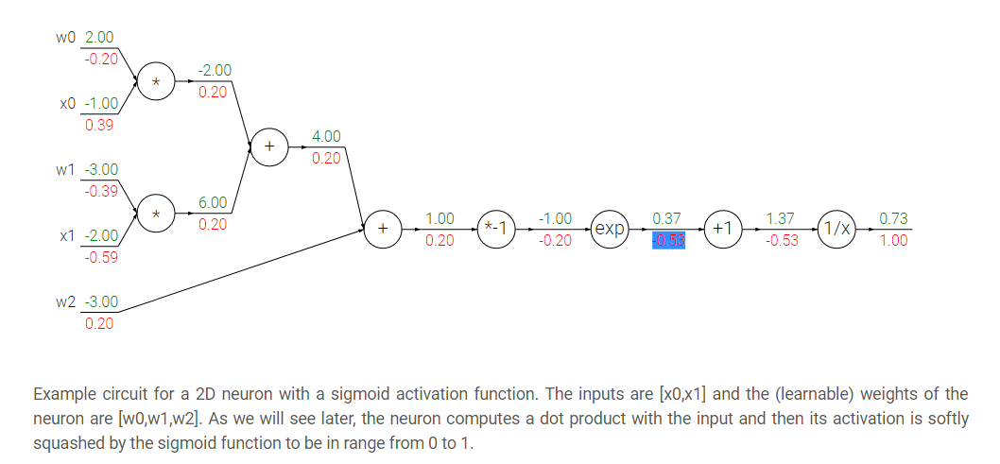
    - Hint: the back propagation of two nodes going to one node from the back is by adding the two derivatives.

  - Modularized implementation: forward/ backward API (example multiply code):

    - ```python
      class MultuplyGate(object):
        """
        x,y are scalars
        """
        def forward(x,y):
          z = x*y
          self.x = x  # Cache
          self.y = y	# Cache
          # We cache x and y because we know that the derivatives contains them.
          return z
        def backward(dz):
          dx = self.y * dz         #self.y is dx
          dy = self.x * dz
          return [dx, dy]
      ```

  - If you look at a deep learning framework you will find it follow the Modularized implementation where each class has a definition for forward and backward. For example:

    - Multiplication
    - Max
    - Plus
    - Minus
    - Sigmoid
    - Convolution

- So to define neural network as a function:

  - (Before) Linear score function: `f = Wx`
  - (Now) 2-layer neural network:    `f = W2*max(0,W1*x)` 
    - Where max is the RELU non linear function
  - (Now) 3-layer neural network:    `f = W3*max(0,W2*max(0,W1*x)`
  - And so on..

- Neural networks is a stack of some simple operation that forms complex operations.


## 05. Convolutional neural networks (CNNs)

- Neural networks history:
  - First perceptron machine was developed by Frank Rosenblatt in 1957. It was used to recognize letters of the alphabet. Back propagation wasn't developed yet.
  - Multilayer perceptron was developed in 1960 by Adaline/Madaline. Back propagation wasn't developed yet.
  - Back propagation was developed in 1986 by Rumeelhart.
  - There was a period which nothing new was happening with NN. Cause of the limited computing resources and data.
  - In [2006](www.cs.toronto.edu/~fritz/absps/netflix.pdf) Hinton released a paper that shows that we can train a deep neural network using Restricted Boltzmann machines to initialize the weights then back propagation.
  - The first strong results was in 2012 by Hinton in [speech recognition](http://ieeexplore.ieee.org/document/6296526/). And the [Alexnet](https://papers.nips.cc/paper/4824-imagenet-classification-with-deep-convolutional-neural-networks.pdf) "Convolutional neural networks" that wins the image net in 2012 also by Hinton's team.
  - After that NN is widely used in various applications.
- Convolutional neural networks history:
  - Hubel & Wisel in 1959 to 1968 experiments on cats cortex found that there are a topographical mapping in the cortex and that the neurons has hireical organization from simple to complex.
  - In 1998, Yann Lecun gives the paper [Gradient-based learning applied to document recognition](http://ieeexplore.ieee.org/document/726791/) that introduced the Convolutional neural networks. It was good for recognizing zip letters but couldn't run on a more complex examples.
  - In 2012 [AlexNet](https://papers.nips.cc/paper/4824-imagenet-classification-with-deep-convolutional-neural-networks.pdf) used the same Yan Lecun architecture and won the image net challenge. The difference from 1998 that now we have a large data sets that can be used also the power of the GPUs solved a lot of performance problems.
  - Starting from 2012 there are CNN that are used for various tasks (Here are some applications):
    - Image classification.
    - Image retrieval.
      - Extracting features using a NN and then do a similarity matching.
    - Object detection.
    - Segmentation.
      - Each pixel in an image takes a label.
    - Face recognition.
    - Pose recognition.
    - Medical images.
    - Playing Atari games with reinforcement learning.
    - Galaxies classification.
    - Street signs recognition.
    - Image captioning.
    - Deep dream.
- ConvNet architectures make the explicit assumption that the inputs are images, which allows us to encode certain properties into the architecture.
- There are a few distinct types of Layers in ConvNet (e.g. CONV/FC/RELU/POOL are by far the most popular)
- Each Layer may or may not have parameters (e.g. CONV/FC do, RELU/POOL don’t)
- Each Layer may or may not have additional hyperparameters (e.g. CONV/FC/POOL do, RELU doesn’t)
- How Convolutional neural networks works?
  - A fully connected layer is a layer in which all the neurons is connected. Sometimes we call it a dense layer.
    - If input shape is `(X, M)` the weighs shape for this will be `(NoOfHiddenNeurons, X)`
  - Convolution layer is a layer in which we will keep the structure of the input by a filter that goes through all the image.
    - We do this with dot product: `W.T*X + b`. This equation uses the broadcasting technique.
    - So we need to get the values of `W` and `b`
    - We usually deal with the filter (`W`) as a vector not a matrix.
  - We call output of the convolution activation map. We need to have multiple activation map.
    - Example if we have 6 filters, here are the shapes:
      - Input image                        `(32,32,3)`
      - filter size                              `(5,5,3)`
        - We apply 6 filters. The depth must be three because the input map has depth of three.
      - Output of Conv.                 `(28,28,6)` 
        - if one filter it will be   `(28,28,1)`
      - After RELU                          `(28,28,6)` 
      - Another filter                     `(5,5,6)`
      - Output of Conv.                 `(24,24,10)`
  - It turns out that convNets learns in the first layers the low features and then the mid-level features and then the high level features.
  - After the Convnets we can have a linear classifier for a classification task.
  - In Convolutional neural networks usually we have some (Conv ==> Relu)s and then we apply a pool operation to downsample the size of the activation.
- What is stride when we are doing convolution:
  - While doing a conv layer we have many choices to make regarding the stride of which we will take. I will explain this by examples.
  - Stride is skipping while sliding. By default its 1.
  - Given a matrix with shape of `(7,7)` and a filter with shape `(3,3)`:
    - If stride is `1` then the output shape will be `(5,5)`              `# 2 are dropped`
    - If stride is `2` then the output shape will be `(3,3)`             `# 4 are dropped`
    - If stride is `3` it doesn't work.
  - A general formula would be `((N-F)/stride +1)`
    - If stride is `1` then `O = ((7-3)/1)+1 = 4 + 1 = 5`
    - If stride is `2` then `O = ((7-3)/2)+1 = 2 + 1 = 3`
    - If stride is `3` then `O = ((7-3)/3)+1 = 1.33 + 1 = 2.33`        `# doesn't work`

- In practice its common to zero pad the border.   `# Padding from both sides.`
  - Give a stride of `1` its common to pad to this equation:  `(F-1)/2` where F is the filter size
    - Example `F = 3` ==> Zero pad with `1`
    - Example `F = 5` ==> Zero pad with `2`
  - If we pad this way we call this same convolution.
  - Adding zeros gives another features to the edges thats why there are different padding techniques like padding the corners not zeros but in practice zeros works!
  - We do this to maintain our full size of the input. If we didn't do that the input will be shrinking too fast and we will lose a lot of data.
- Example:
  - If we have input of shape `(32,32,3)` and ten filters with shape is `(5,5)` with stride `1` and pad `2`
    - Output size will be `(32,32,10)`                       `# We maintain the size.`
  - Size of parameters per filter `= 5*5*3 + 1 = 76`
  - All parameters `= 76 * 10 = 76`
- Number of filters is usually common to be to the power of 2.           `# To vectorize well.`
- So here are the parameters for the Conv layer:
  - Number of filters K.
    - Usually a power of 2.
  - Spatial content size F.
    - 3,5,7 ....
  - The stride S. 
    - Usually 1 or 2        (If the stride is big there will be a downsampling but different of pooling) 
  - Amount of Padding
    - If we want the input shape to be as the output shape, based on the F if 3 its 1, if F is 5 the 2 and so on.
- Pooling makes the representation smaller and more manageable.
- Pooling Operates over each activation map independently.
- Example of pooling is the maxpooling.
  - Parameters of max pooling is the size of the filter and the stride"
    - Example `2x2` with stride `2`                     `# Usually the two parameters are the same 2 , 2`
- Also example of pooling is average pooling.
  - In this case it might be learnable.


## 06. Training neural networks I

- As a revision here are the Mini batch stochastic gradient descent algorithm steps:

  - Loop:
    1. Sample a batch of data.
    2. Forward prop it through the graph (network) and get loss.
    3. Backprop to calculate the gradients.
    4. Update the parameters using the gradients.

- Activation functions:

  - Different choices for activation function includes Sigmoid, tanh, RELU, Leaky RELU, Maxout, and ELU.

  - 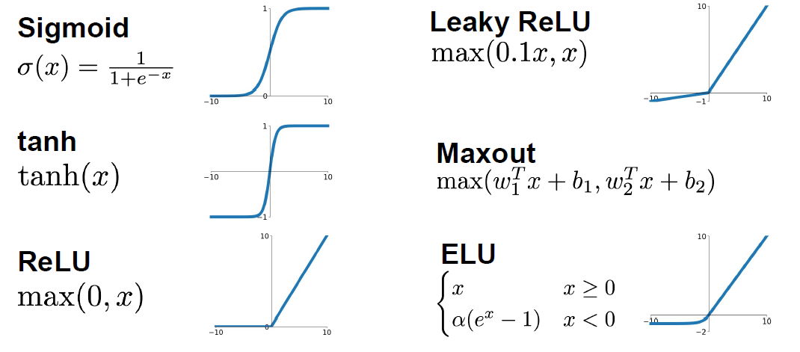

  - Sigmoid:

    - Squashes the numbers between [0,1]
    - Used as a firing rate like human brains.
    - `Sigmoid(x) = 1 / (1 + e^-x)`
    - Problems with sigmoid:
      - big values neurons ***kill*** the gradients.
        - Gradients are in most cases near 0 (Big values/small values), that kills the updates if the graph/network are large.
      - Not Zero-centered.
        - Didn't produce zero-mean data.
      - `exp()` is a bit compute expensive.
        - just to mention. We have a more complex operations in deep learning like convolution.

  - Tanh:

    - Squashes the numbers between [-1,1]
    - Zero centered.
    - Still big values neurons "kill" the gradients.
    - `Tanh(x)` is the equation.
    - Proposed by Yann Lecun in 1991.

  - RELU (Rectified linear unit):

    - `RELU(x) = max(0,x)`
    - Doesn't kill the gradients.
      - Only small values that are killed. Killed the gradient in the half
    - Computationally efficient.
    - Converges much faster than Sigmoid and Tanh `(6x)`
    - More biologically plausible than sigmoid.
    - Proposed by Alex Krizhevsky in 2012 Toronto university. (AlexNet)
    - Problems:
      - Not zero centered.
    - If weights aren't initialized good, maybe 75% of the neurons will be dead and thats a waste computation. But its still works. This is an active area of research to optimize this.
    - To solve the issue mentioned above, people might initialize all the biases by 0.01

  - Leaky RELU:

    - `leaky_RELU(x) = max(0.01x,x)`
    - Doesn't kill the gradients from both sides.
    - Computationally efficient.
    - Converges much faster than Sigmoid and Tanh (6x)
    - Will not die.
    - PRELU is placing the 0.01 by a variable alpha which is learned as a parameter.

  - Exponential linear units (ELU):

    - ```
      ELU(x) = { x                                           if x > 0
      		   alpah *(exp(x) -1)		                   if x <= 0
                 # alpah are a learning parameter
      }
      ```

    - It has all the benefits of RELU

    - Closer to zero mean outputs and adds some robustness to noise.

    - problems

      - `exp()` is a bit compute expensive. 

  - Maxout activations:

    - `maxout(x) = max(w1.T*x + b1, w2.T*x + b2)`
    - Generalizes RELU and Leaky RELU
    - Doesn't die!
    - Problems:
      - oubles the number of parameters per neuron

  - In practice:

    - Use RELU. Be careful for your learning rates.
    - Try out Leaky RELU/Maxout/ELU
    - Try out tanh but don't expect much.
    - Don't use sigmoid!

- **Data preprocessing**:

  - Normalize the data:

  - ```python
    # Zero centered data. (Calculate the mean for every input).
    # On of the reasons we do this is because we need data to be between positive and negative and not all the be negative or positive. 
    X -= np.mean(X, axis = 1)

    # Then apply the standard deviation. Hint: in images we don't do this.
    X /= np.std(X, axis = 1)
    ```

  - To normalize images:

    - Subtract the mean image (E.g. Alexnet)
      - Mean image shape is the same as the input images.
    - Or Subtract per-channel mean 
      - Means calculate the mean for each channel of all images. Shape is 3 (3 channels)

- **Weight initialization**:

  - What happened when initialize all Ws with zeros?

    - All the neurons will do exactly the same thing. They will have the same gradient and they will have the same update.
    - So if W's of a specific layer is equal the thing described happened

  - First idea is to initialize the w's with small random numbers:

    - ```python
      W = 0.01 * np.random.rand(D, H)
      # Works OK for small networks but it makes problems with deeper networks!
      ```

    - The standard deviations is going to zero in deeper networks. and the gradient will vanish sooner in deep networks.

    - ```python
      W = 1 * np.random.rand(D, H) 
      # Works OK for small networks but it makes problems with deeper networks!
      ```

    - The network will explode with big numbers!

  - ***Xavier initialization***:

    - ```python
      W = np.random.rand(in, out) / np.sqrt(in)
      ```

    - It works because we want the variance of the input to be as the variance of the output.

    - But it has an issue, It breaks when you are using RELU.

  - ***He initialization*** (Solution for the RELU issue):

    - ```python
      W = np.random.rand(in, out) / np.sqrt(in/2)
      ```

    - Solves the issue with RELU. Its recommended when you are using RELU

  - Proper initialization is an active area of research.

- **Batch normalization**:

  - is a technique to provide any layer in a Neural Network with inputs that are zero mean/unit variance.
  - It speeds up the training. You want to do this a lot.
    - Made by Sergey Ioffe and Christian Szegedy at 2015.
  - We make a Gaussian activations in each layer. by calculating the mean and the variance.
  - Usually inserted after (fully connected or Convolutional layers) and (before nonlinearity).
  - Steps (For each output of a layer)
    1. First we compute the mean and variance^2 of the batch for each feature.
    2. We normalize by subtracting the mean and dividing by square root of (variance^2 + epsilon)
       - epsilon to not divide by zero
    3. Then we make a scale and shift variables: `Result = gamma * normalizedX + beta`  
       - gamma and beta are learnable parameters.
       - it basically possible to say “Hey!! I don’t want zero mean/unit variance input, give me back the raw input - it’s better for me.”
       - Hey shift and scale by what you want not just the mean and variance!
  - The algorithm makes each layer flexible (It chooses which distribution it wants)
  - We initialize the BatchNorm Parameters to transform the input to zero mean/unit variance distributions but during training they can learn that any other distribution might be better.
  - During the running of the training we need to calculate the globalMean and globalVariance for each layer by using weighted average.
  - <u>Benefits of Batch Normalization</u>:
    - Networks train faster.
    - Allows higher learning rates.
    - helps reduce the sensitivity to the initial starting weights.
    - Makes more activation functions viable.
    - Provides some regularization.
      - Because we are calculating mean and variance for each batch that gives a slight regularization effect.
  - In conv layers, we will have one variance and one mean per activation map.
  - Batch normalization have worked best for CONV and regular deep NN, But for recurrent NN and reinforcement learning its still an active research area.
    - Its challengey in reinforcement learning because the batch is small.

- **Baby sitting the learning process**

  1. Preprocessing of data.
  2. Choose the architecture.
  3. Make a forward pass and check the loss (Disable regularization). Check if the loss is reasonable.
  4. Add regularization, the loss should go up!
  5. Disable the regularization again and take a small number of data and try to train the loss and reach zero loss.
     - You should overfit perfectly for small datasets.
  6. Take your full training data, and small regularization then try some value of learning rate.
     - If loss is barely changing, then the learning rate is small.
     - If you got `NAN` then your NN exploded and your learning rate is high.
     - Get your learning rate range by trying the min value (That can change) and the max value that doesn't explode the network.
  7. Do Hyperparameters optimization to get the best hyperparameters values.

- Hyperparameter Optimization

  - Try Cross validation strategy.
    - Run with a few ephocs, and try to optimize the ranges.
  - Its best to optimize in log space.
  - Adjust your ranges and try again.
  - Its better to try random search instead of grid searches (In log space)


## 07. Training neural networks II

- **Optimization algorithms**:

  - Problems with stochastic gradient descent:

    - if loss quickly in one direction and slowly in another (For only two variables), you will get very slow progress along shallow dimension, jitter along steep direction. Our NN will have a lot of parameters then the problem will be more.
    - Local minimum or saddle points
      - If SGD went into local minimum we will stuck at this point because the gradient is zero.
      - Also in saddle points the gradient will be zero so we will stuck.
      - Saddle points says that at some point:
        - Some gradients will get the loss up.
        - Some gradients will get the loss down.
        - And that happens more in high dimensional (100 million dimension for example)
      - The problem of deep NN is more about saddle points than about local minimum because deep NN has high dimensions (Parameters)
      - Mini batches are noisy because the gradient is not taken for the whole batch.

  - **SGD + momentum**:

    - Build up velocity as a running mean of gradients:

    - ```python
      # Computing weighted average. rho best is in range [0.9 - 0.99]
      V[t+1] = rho * v[t] + dx
      x[t+1] = x[t] - learningRate * V[t+1]
      ```

    - `V[0]` is zero.

    - Solves the saddle point and local minimum problems.

    - It overshoots the problem and returns to it back.

  - **Nestrov momentum**:

    - ```python
      dx = compute_gradient(x)
      old_v = v
      v = rho * v - learning_rate * dx
      x+= -rho * old_v + (1+rho) * v
      ```

    - Doesn't overshoot the problem but slower than SGD + momentum

  - **AdaGrad**

    - ```python
      grad_squared = 0
      while(True):
        dx = compute_gradient(x)
        
        # here is a problem, the grad_squared isn't decayed (gets so large)
        grad_squared += dx * dx			
        
        x -= (learning_rate*dx) / (np.sqrt(grad_squared) + 1e-7)
      ```

  - **RMSProp**

    - ```python
      grad_squared = 0
      while(True):
        dx = compute_gradient(x)
        
        #Solved ADAgra
        grad_squared = decay_rate * grad_squared + (1-grad_squared) * dx * dx  
        
        x -= (learning_rate*dx) / (np.sqrt(grad_squared) + 1e-7)
      ```

    - People uses this instead of AdaGrad

  - **Adam**

    - Calculates the momentum and RMSProp as the gradients.
    - It need a Fixing bias to fix starts of gradients.
    - Is the best technique so far runs best on a lot of problems.
    - With `beta1 = 0.9` and `beta2 = 0.999` and `learning_rate = 1e-3` or `5e-4` is a great starting point for many models!

  - **Learning decay**

    - Ex. decay learning rate by half every few epochs.
    - To help the learning rate not to bounce out.
    - Learning decay is common with SGD+momentum but not common with Adam.
    - Dont use learning decay from the start at choosing your hyperparameters. Try first and check if you need decay or not.

  - All the above algorithms we have discussed is a first order optimization.

  - **Second order optimization**

    - Use gradient and Hessian to from quadratic approximation.
    - Step to the minima of the approximation.
    - What is nice about this update?
      - It doesn't has a learning rate in some of the versions.
    - But its unpractical for deep learning
      - Has O(N^2) elements.
      - Inverting takes O(N^3).
    - **L-BFGS** is a version of second order optimization
      - Works with batch optimization but not with mini-batches.

  - In practice first use ADAM and if it didn't work try L-BFGS.

  - Some says all the famous deep architectures uses **SGS + Nestrov momentum**

- **Regularization**

  - So far we have talked about reducing the training error, but we care about most is how our model will handle unseen data!
  - What if the gab of the error between training data and validation data are too large?
  - This error is called high variance.
  - **Model Ensembles**:
    - Algorithm:
      - Train multiple independent models of the same architecture with different initializations.
      - At test time average their results.
    - It can get you extra 2% performance.
    - It reduces the generalization error.
    - You can use some snapshots of your NN at the training ensembles them and take the results.
  - Regularization solves the high variance problem. We have talked about L1, L2 Regularization.
  - Some Regularization techniques are designed for only NN and can do better.
  - **Drop out**:
    - In each forward pass, randomly set some of the neurons to zero. Probability of dropping is a hyperparameter that are 0.5 for almost cases.
    - So you will chooses some activation and makes them zero.
    - It works because:
      - It forces the network to have redundant representation; prevent co-adaption of features!
      - If you think about this, It ensemble some of the models in the same model!
    - At test time we might multiply each dropout layer by the probability of the dropout.
    - Sometimes at test time we don't multiply anything and leave it as it is.
    - With drop out it takes more time to train.
  - **Data augmentation**:
    - Another technique that makes Regularization.
    - Change the data!
    - For example flip the image, or rotate it.
    - Example in ResNet:
      - Training: Sample random crops and scales:
        1. Pick random L in range [256,480]
        2. Resize training image, short side = L
        3. Sample random 224x244 patch.
      - Testing: average a fixed set of crops
        1. Resize image at 5 scales: {224, 256, 384, 480, 640}
        2. For each size, use 10 224x224 crops: 4 corners + center + flips
      - Apply Color jitter or PCA
      - Translation, rotation, stretching.
  - Drop connect
    - Like drop out idea it makes a regularization.
    - Instead of dropping the activation, we randomly zeroing the weights.
  - Fractional Max Pooling
    - Cool regularization idea. Not commonly used.
    - Randomize the regions in which we pool.
  - Stochastic depth
    - New idea.
    - Eliminate layers, instead on neurons.
    - Has the similar effect of drop out but its a new idea.

- **Transfer learning**:

  - Some times your data is overfitted by your model because the data is small not because of regularization.

  - You need a lot of data if you want to train/use CNNs.

  - Steps of transfer learning

    1. Train on a big dataset that has common features with your dataset. Called pretraining.
    2. Freeze the layers except the last layer and feed your small dataset to learn only the last layer.
    3. Not only the last layer maybe trained again, you can fine tune any number of layers you want based on the number of data you have

  - Guide to use transfer learning:

    - |                         | Very Similar dataset               | very different dataset                   |
      | ----------------------- | ---------------------------------- | ---------------------------------------- |
      | **very little dataset** | Use Linear classifier on top layer | You're in trouble.. Try linear classifier from different stages |
      | **quite a lot of data** | Finetune a few layers              | Finetune a large layers                  |

  - Transfer learning is the normal not an exception.


## 08. Deep learning software

- This section changes a lot every year in CS231n due to rabid changes in the deep learning softwares.
- CPU vs GPU
  - GPU The graphics card was developed to render graphics to play games or make 3D media,. etc.
    - NVIDIA vs AMD
      - Deep learning choose NVIDIA over AMD GPU because NVIDIA is pushing research forward deep learning also makes it architecture more suitable for deep learning.
  - CPU has fewer cores but each core is much faster and much more capable; great at sequential tasks. While GPUs has more cores but each core is much slower "dumber"; great for parallel tasks.
  - GPU cores needs to work together. and has its own memory.
  - Matrix multiplication is from the operations that are suited for GPUs. It has MxN independent operations that can be done on parallel.
  - Convolution operation also can be paralyzed because it has independent operations.
  - Programming GPUs frameworks:
    - **CUDA** (NVIDIA only)
      - Write c-like code that runs directly on the GPU.
      - Its hard to build a good optimized code that runs on GPU. Thats why they provided high level APIs.
      - Higher level APIs: cuBLAS, cuDNN, etc
      - **CuDNN** has implemented back prop. , convolution, recurrent and a lot more for you!
      - In practice you won't write a parallel code. You will use the code implemented and optimized by others!
    - **OpenCl**
      - Similar to CUDA, but runs on any GPU.
      - Usually Slower .
      - Haven't much support yet from all deep learning softwares.
  - There are a lot of courses for learning parallel programming.
  - If you aren't careful, training can bottleneck on reading dara and transferring to GPU. So the solutions are:
    - Read all the data into RAM. # If possible
    - Use SSD instead of HDD
    - Use multiple CPU threads to prefetch data!
      - While the GPU are computing, a CPU thread will fetch the data for you.
      - A lot of frameworks implemented that for you because its a little bit painful!
- **Deep learning Frameworks**
  - Its super fast moving!
  - Currently available frameworks:
    - Tensorflow (Google)
    - Caffe (UC Berkeley)
    - Caffe2 (Facebook)
    - Torch (NYU / Facebook)
    - PyTorch (Facebook)
    - Theano (U monteral) 
    - Paddle (Baidu)
    - CNTK (Microsoft)
    - MXNet (Amazon)
  - The instructor thinks that you should focus on Tensorflow and PyTorch.
  - The point of deep learning frameworks:
    - Easily build big computational graphs.
    - Easily compute gradients in computational graphs.
    - Run it efficiently on GPU (cuDNN - cuBLAS)
  - Numpy doesn't run on GPU.
  - Most of the frameworks tries to be like NUMPY in the forward pass and then they compute the gradients for you.
- **Tensorflow (Google)**
  - Code are two parts:
    1. Define computational graph.
    2. Run the graph and reuse it many times.
  - Tensorflow uses a static graph architecture.
  - Tensorflow variables live in the graph. while the placeholders are feed each run.
  - Global initializer function initializes the variables that lives in the graph.
  - Use predefined optimizers and losses.
  - You can make a full layers with layers.dense function.
  - **Keras** (High level wrapper):
    - Keras is a layer on top pf Tensorflow, makes common things easy to do.
    - So popular!
    - Trains a full deep NN in a few lines of codes.
  - There are a lot high level wrappers:
    - Keras
    - TFLearn
    - TensorLayer
    - tf.layers   `#Ships with tensorflow`
    - tf-Slim   `#Ships with tensorflow`
    - tf.contrib.learn   `#Ships with tensorflow`
    - Sonnet `# New from deep mind`
  - Tensorflow has pretrained models that you can use while you are using transfer learning.
  - Tensorboard adds logging to record loss, stats. Run server and get pretty graphs!
  - It has distributed code if you want to split your graph on some nodes.
  - Tensorflow is actually inspired from Theano. It has the same inspirations and structure.


- **PyTorch (Facebook)**

  - Has three layers of abstraction:
    - Tensor: `ndarray` but runs on GPU     `#Like numpy arrays in tensorflow`
    - Variable: Node in a computational graphs; stores data and gradient 	`#Like Tensor, Variable, Placeholders`
    - Module: A NN layer; may store state or learnable weights`#Like tf.layers in tensorflow`
  - In PyTorch the graphs runs in the same loop you are executing which makes it easier for debugging. This is called a dynamic graph.
  - In PyTorch you can define your own autograd functions by writing forward and backward for tensors. Most of the times it will implemented for you.
  - Torch.nn is a high level api like keras in tensorflow. You can create the models and go on and on.
    - You can define your own nn module!
  - Also Pytorch contains optimizers like tensorflow.
  - It contains a data loader that wraps a Dataset and provides minbatches, shuffling and multithreading.
  - PyTorch contains the best and super easy to use pretrained models
  - PyTorch contains Visdom that are like tensorboard. but Tensorboard seems to be more powerful.
  - PyTorch is new and still evolving compared to Torch. Its still in beta state.
  - PyTorch is best for research.

- Tensorflow builds the graph once, then run them many times (Called static graph)

- In each PyTorch iteration we build a new graph (Called dynamic graph)

- **Static vs dynamic graphs**:

  - Optimization:

    - With static graphs, framework can optimize the graph for you before it runs.

  - Serialization

    - **Static**: Once graph is built, can serialize it and run it without the code that built the graph. Ex use the graph in c++


    - **Dynamic**: Always need to keep the code around.

  - Conditional

    - Is easier in dynamic graphs. And more complicated in static graphs.

  - Loops:

    - Is easier in dynamic graphs. And more complicated in static graphs.

- Tensorflow fold make dynamic graphs easier in Tensorflow through dynamic batching.

- Dynamic graph applications include: recurrent networks and recursive networks.

- Caffe2 uses static graphs and can train model in python also works on IOS and Android

- Tensorflow/Caffe2 are used a lot in production especially on mobile.

## 09. CNN architectures

- This section talks about the famous CNN architectures. Focuses on CNN architectures that won [ImageNet](www.image-net.org/) competition since 2012.

  - 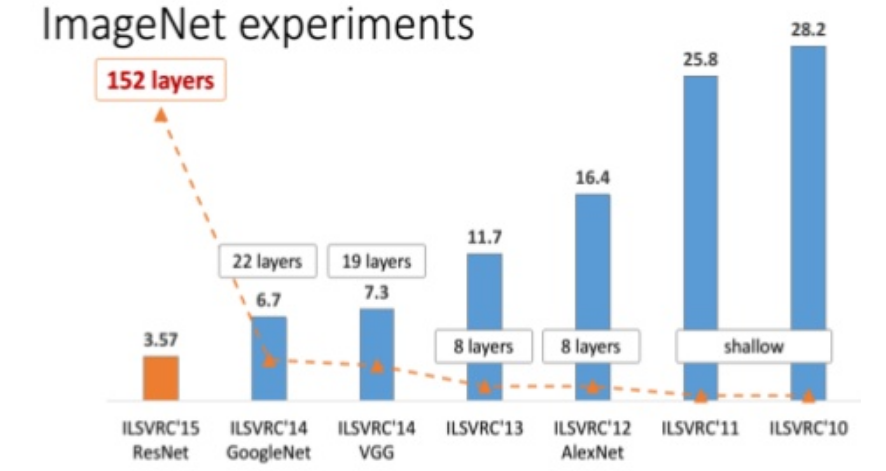

- These architectures includes: [AlexNet](https://papers.nips.cc/paper/4824-imagenet-classification-with-deep-convolutional-neural-networks.pdf), [VGG](https://arxiv.org/abs/1409.1556), [GoogLeNet](https://research.google.com/pubs/pub43022.html), and [ResNet](https://arxiv.org/abs/1512.03385).

- Also we will discuss some interesting architectures as we go.

- The first ConvNet that was made was [LeNet-5](http://ieeexplore.ieee.org/document/726791/) architectures are:by Yann Lecun at 1998.

  - Architecture are: `CONV-POOL-CONV-POOL-FC-FC-FC`
    - 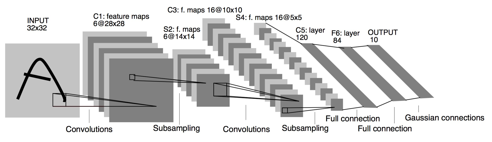
  - Each conv filters was `5x5` applied at stride 1
  - Each pool was `2x2` applied at stride `2`
  - It was useful in Digit recognition.
  - In particular the insight that image features are distributed across the entire image, and convolutions with learnable parameters are an effective way to extract similar features at multiple location with few parameters.
  - It contains exactly **<u>5 </u>** layers

- In [2010](https://arxiv.org/abs/1003.0358) Dan Claudiu Ciresan and Jurgen Schmidhuber published one of the very fist implementations of GPU Neural nets. This implementation had both forward and backward implemented on a a NVIDIA GTX 280 graphic processor of an up to 9 layers neural network.

- [**AlexNet**](https://papers.nips.cc/paper/4824-imagenet-classification-with-deep-convolutional-neural-networks.pdf) (2012):

  - ConvNet that started the evolution and wins the ImageNet at 2012.
  - Architecture are: `CONV1-MAXPOOL1-NORM1-CONV2-MAXPOOL2-NORM2-CONV3-CONV4-CONV5-MAXPOOL3-FC6-FC7-FC8`
  - Contains exactly **<u>8</u>** layers the first 5 are Convolutional and the last 3 are fully connected layers.
  - AlexNet accuracy error was `16.4%`
  - For example if the input is 227 x 227 x3 then these are the shapes of the of the outputs at each layer:
    - CONV1	(96 11 x 11 filters at stride 4, pad 0)
      - Output shape `(55,55,96)`,   Number of weights are `(11*11*3*96)+96 = 34944`
    - MAXPOOL1 (3 x 3 filters applied at stride 2)
      - Output shape `(27,27,96)`,   No Weights
    - NORM1
      - Output shape `(27,27,96)`, 	We don't do this any more
    - CONV2 (256 5 x 5 filters at stride 1, pad 2)
    - MAXPOOL2 (3 x 3 filters at stride 2)
    - NORM2
    - CONV3 (384 3 x 3 filters ar stride 1, pad 1)
    - CONV4 (384 3 x 3 filters ar stride 1, pad 1)
    - CONV5 (256 3 x 3 filters ar stride 1, pad 1)
    - MAXPOOL3 (3 x 3 filters at stride 2)
      - Output shape `(6,6,256)`
    - FC6 (4096)
    - FC7 (4096)
    - FC8 (1000 neurons for class score)
  - Some other details:
    - First use of RELU.
    - Norm layers but not used any more.
    - heavy data augmentation
    - Dropout `0.5`
    - batch size `128`
    - SGD momentum `0.9`
    - Learning rate `1e-2` reduce by 10 at some iterations
    - 7 CNN ensembles!
  - AlexNet was trained on GTX 580 GPU with only 3 GB which wasn't enough to train in one machine so they have spread the feature maps in half. The first AlexNet was distributed!
  - Its still used in transfer learning in a lot of tasks.
  - Total number of parameters are `60 million`

- [**ZFNet**](https://arxiv.org/abs/1311.2901) (2013)

  - Won in 2013 with error 11.7%
  - It has the same general structure but they changed a little in hyperparameters to get the best output.
  - Also contains **<u>8</u>** layers.
  - AlexNet but:
    - `CONV1`: change from (11 x 11 stride 4) to (7 x 7 stride 2)
    - `CONV3,4,5`: instead of 384, 384, 256 filters use 512, 1024, 512

- [OverFeat](https://arxiv.org/abs/1312.6229) (2013)

  - Won the localization in imageNet in 2013
  - We show how a multiscale and sliding window approach can be efficiently implemented within a ConvNet. We also introduce a novel deep learning approach to localization by learning to predict object boundaries.

- [**VGGNet**](https://arxiv.org/pdf/1409.1556) (2014) (Oxford)

  - Deeper network with more layers.
  - Contains 19 layers.
  - Won on 2014 with GoogleNet with error 7.3%
  - Smaller filters with deeper layers.
  - The great advantage of VGG was the insight that multiple 3 × 3 convolution in sequence can emulate the effect of larger receptive fields, for examples 5 × 5 and 7 × 7.
  - Used the simple 3 x 3 Conv all through the network.
    - 3 (3 x 3) filters has the same effect as 7 x 7
  - 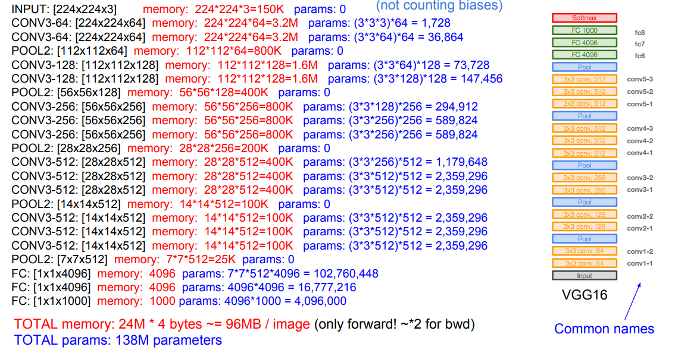
  - The Architecture contains several CONV layers then POOL layer over 5 times and then the full connected layers.
  - It has a total memory of 96MB per image for only forward propagation!
    - Most memory are in the earlier layers
  - Total number of parameters are 138 million
    - Most of the parameters are in the fully connected layers
  - Has a similar details in training like AlexNet. Like using momentum and dropout.
  - VGG19 are an upgrade for VGG16 that are slightly better but with more memory
    - 

- [**GoogleNet**](https://research.google.com/pubs/pub43022.html) (2014)

  - Deeper network with more layers.
  - Contains 22 layers.
  - It has Efficient **<u>Inception</u>** module.
  - Only 5 million parameters! 12x less than AlexNet
  - Won on 2014 with VGGNet with error 6.7%
  - Inception module:
    - Design a good local network topology (network within a network (NiN)) and then stack these modules on top of each other.
    - It consists of:
      - Apply parallel filter operations on the input from previous layer
        - Multiple convs of sizes (1 x 1, 3 x 3, 5 x 5) 
          - Adds padding to maintain the sizes.
        - Pooling operation. (Max Pooling)
          - Adds padding to maintain the sizes.
      - Concatenate all filter outputs together depth-wise.
    - For example:
      - Input for inception module is 28 x 28 x 256
      - Then the parallel filters applied:
        - (1 x 1), 128 filter               `# output shape (28,28,128)`
        - (3 x 3), 192 filter                 `# output shape (28,28,192)`
        - (5 x 5), 96 filter                   `# output shape (28,28,96)`
        - (3 x 3) Max pooling            `# output shape (28,28,256)`
      - After concatenation this will be `(28,28,672)`
    - By this design -We call Naive- it has a big computation complexity.
      - The last example will make:
        - [1 x 1 conv, 128] ==> 28 * 28 * 128 * 1 * 1 * 256 = 25 Million approx
        - [3 x 3 conv, 192] ==> 28 * 28 * 192 *3 *3 * 256 = 346 Million approx
        - [5 x 5 conv, 96] ==> 28 * 28 * 96 * 5 * 5 * 256 = 482 Million approx
        - In total around 854 Million operation!
    - Solution: **bottleneck** layers that use 1x1 convolutions to reduce feature depth.
      - Inspired from NiN ([Network in network](https://arxiv.org/abs/1312.4400))
    - 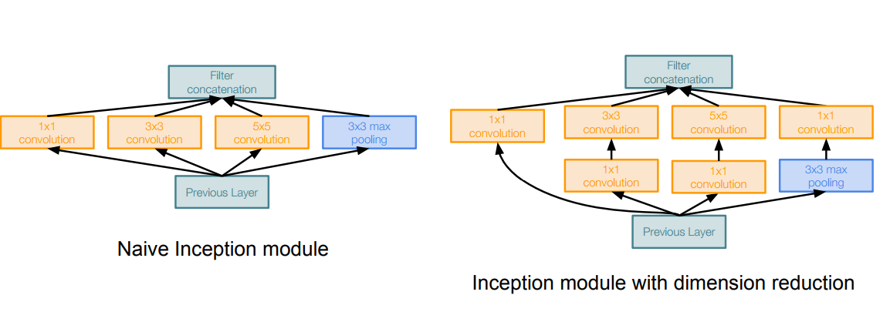
    - The bottleneck solution will make a total operations of 358M on this example which is good compared with the naive implementation.
  - So GoogleNet stacks this Inception module multiple times to get a full architecture of a network that can solve a problem without the Fully connected layers.
  - Just to mention, it uses an average pooling layer at the end before the classification step.
  - Full architecture:
    - 
  - In February 2015 Batch-normalized Inception was introduced as Inception V2. Batch-normalization computes the mean and standard-deviation of all feature maps at the output of a layer, and normalizes their responses with these values.
  - In December [2015](https://arxiv.org/abs/1512.00567) they introduced a paper "Rethinking the Inception Architecture for Computer Vision" which explains the older inception models well also introducing a new version V3.

- The first GoogleNet and VGG was before batch normalization invented so they had some hacks to train the NN and converge well.

- [**ResNet**](https://arxiv.org/abs/1512.03385) (2015) (Microsoft Research)

  - 152-layer model for ImageNet. Winner by 3.57% which is more than human level error.

  - This is also the very first time that a network of > hundred, even 1000 layers was trained.

  - Swept all classification and detection competitions in ILSVRC’15 and COCO’15!

  - What happens when we continue stacking deeper layers on a “plain” Convolutional neural network?

    - The deeper model performs worse, but it’s not caused by overfitting!
    - The learning stops performs well somehow because deeper NN are harder to optimize!

  - The deeper model should be able to perform at least as well as the shallower model.

  - A solution by construction is copying the learned layers from the shallower model and setting additional layers to identity mapping.

  - Residual block:

    - Microsoft came with the Residual block which has this architecture:

      - 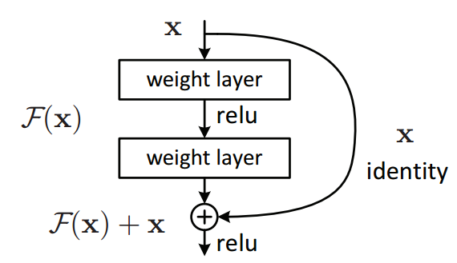

    - ```python
      # Instead of us trying To learn a new representation, We learn only Residual
      Y = (W2* RELU(W1x+b1) + b2) + X
      ```

    - Say you have a network till a depth of N layers. You only want to add a new layer if you get something extra out of adding that layer.

    - One way to ensure this new (N+1)th layer learns something new about your network is to also provide the input(x) without any transformation to the output of the (N+1)th layer. This essentially drives the new layer to learn something different from what the input has already encoded.

    - The other advantage is such connections help in handling the Vanishing gradient problem in very deep networks.

  - With the Residual block we can now have a deep NN of any depth without the fearing that we can't optimize the network.

  - ResNet with a large number of layers started to use a bottleneck layer similar to the Inception bottleneck to reduce the dimensions.

    - 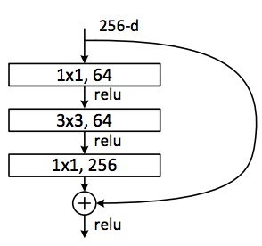

  - **<u>Full ResNet architecture</u>**:

    - Stack residual blocks.
      - 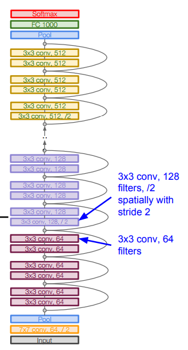
    - Every residual block has two 3 x 3 conv layers.
    - Additional conv layer at the beginning.
    - No FC layers at the end (only FC 1000 to output classes)
    - Periodically, double number of filters and downsample spatially using stride 2 (/2 in each dimension)
    - Training ResNet in practice:
      - Batch Normalization after every CONV layer.
      - Xavier/2 initialization from He et al.
      - SGD + Momentum (`0.9`) 
      - Learning rate: 0.1, divided by 10 when validation error plateaus
      - Mini-batch size `256`
      - Weight decay of `1e-5`
      - No dropout used.

- [Inception-v4](https://arxiv.org/abs/1602.07261): Resnet + Inception and was founded in 2016.

- The complexity comparing over all the architectures:

  - 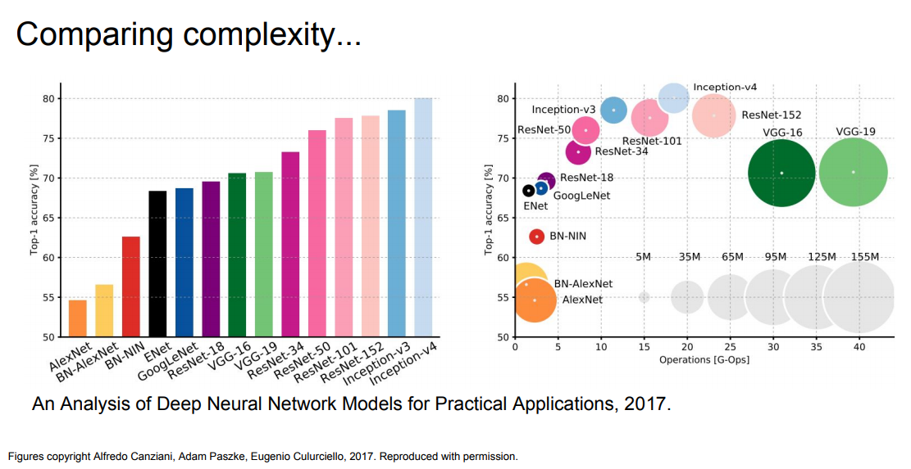
  - VGG: Highest memory, most operations.
  - GoogLeNet: most efficient.

- **ResNets Improvements**:

  - ([2016](https://arxiv.org/abs/1603.05027)) <u>Identity Mappings in Deep Residual Networks</u>
    - From the creators of ResNet.
    - Gives better performance.
  - ([2016](https://arxiv.org/abs/1605.07146)) <u>Wide Residual Networks</u>
    - Argues that residuals are the important factor, not depth
    - 50-layer wide ResNet outperforms 152-layer original ResNet
    - Increasing width instead of depth more computationally efficient (parallelizable)
  - ([2016](https://arxiv.org/abs/1603.09382)) Deep Networks with Stochastic Depth
    - Motivation: reduce vanishing gradients and training time through short networks during training.
    - Randomly drop a subset of layers during each training pass
    - Use full deep network at test time.

- **Beyond ResNets**:

  - ([2017](https://arxiv.org/abs/1605.07648)) <u>FractalNet: Ultra-Deep Neural Networks without Residuals</u>
    - Argues that key is transitioning effectively from shallow to deep and residual representations are not necessary.
    - Trained with dropping out sub-paths
    - Full network at test time.
  - ([2017](https://arxiv.org/abs/1608.06993)) <u>Densely Connected Convolutional Networks</u>
  - ([2017](https://arxiv.org/abs/1602.07360)) SqueezeNet: AlexNet-level Accuracy With 50x Fewer Parameters and <0.5Mb Model Size
    - Good for production.
    - It is a re-hash of many concepts from ResNet and Inception, and show that after all, a better design of architecture will deliver small network sizes and parameters without needing complex compression algorithms.

- Conclusion:

  - ResNet current best default.
  - Trend towards extremely deep networks
  - In the last couple of years, some models all using the shortcuts like "ResNet" to eaisly flow the gradients.


## 10. Recurrent Neural networks

- Vanilla Neural Networks "Feed neural networks", input of fixed size goes through some hidden units and then go to output. We call it a one to one network.

- Recurrent Neural Networks RNN can work with Sequences:

  - 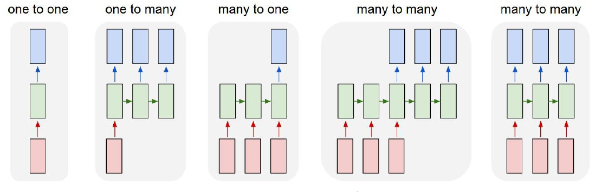
  - One to many
    - Example: Image Captioning
      - image ==> sequence of words
  - Many to One
    - Example: Sentiment Classification
      - sequence of words ==> sentiment
  - Many to many
    - Example: Machine Translation
      - seq of words in one language ==> seq of words in another language
    - Example: Video classification on frame level

- RNNs can also work for Non-Sequence Data (One to One problems)

  - It worked in Digit classification through taking a series of “glimpses”
    - “[Multiple Object Recognition with Visual Attention](https://arxiv.org/abs/1412.7755)”, ICLR 2015.
  - It worked on generating images one piece at a time
    - i.e generating a [captcha](http://ieeexplore.ieee.org/document/7966808/)

- So what is a recurrent neural network?

  - Recurrent core cell that take an input x and that cell has an internal state that are updated each time it reads an input.

  - 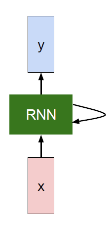

  - The RNN block should return a vector.

  - We can process a sequence of vectors x by applying a recurrence formula at every time step:

    - ```python
      h[t] = fw (h[t-1], x[t])			# Where fw is some function with parameters W
      ```

    - The same function and the same set of parameters are used at every time step.

  - (Vanilla) Recurrent Neural Network:

    - ```
      h[t] = tanh (W[h,h]*h[t-1] + W[x,h]*x[t])    # Then we save h[t]
      y[t] = W[h,y]*h[t]
      ```

    - This is the simplest example of a RNN.

  - RNN works on a sequence of related data.

- Recurrent NN Computational graph:

  - 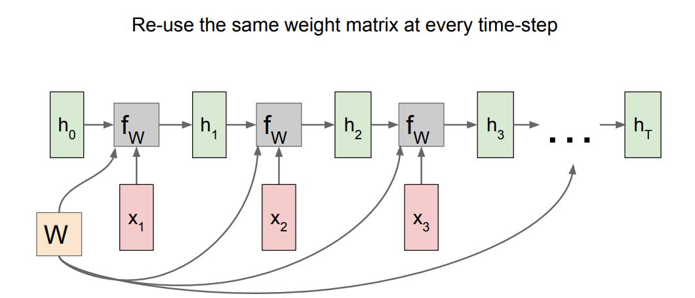
  - `h0` are initialized to zero.
  - Gradient of `W` is the sum of all the `W` gradients that has been calculated!
  - A many to many graph:
    - 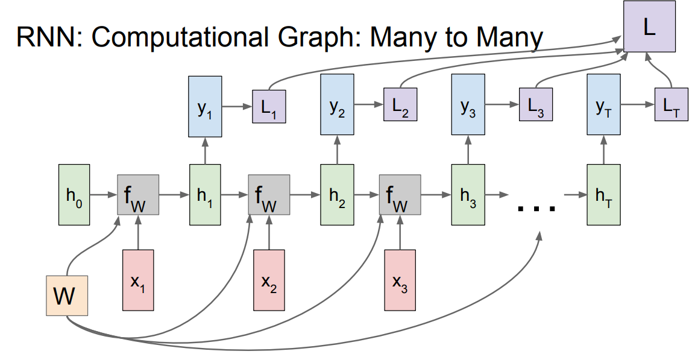
    - Also the last is the sum of all losses and the weights of Y is one and is updated through summing all the gradients!
  - A many to one graph:
    - 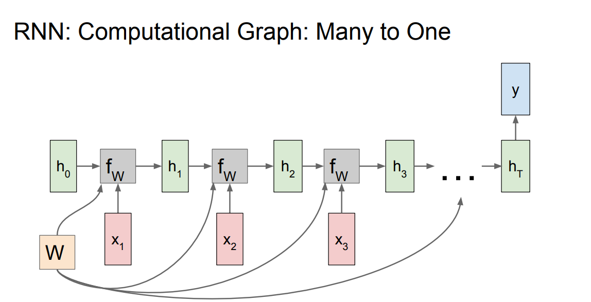
  - A one to many graph:
    - 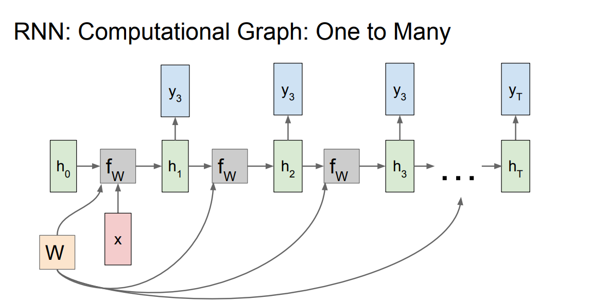
  - sequence to sequence graph:
    - 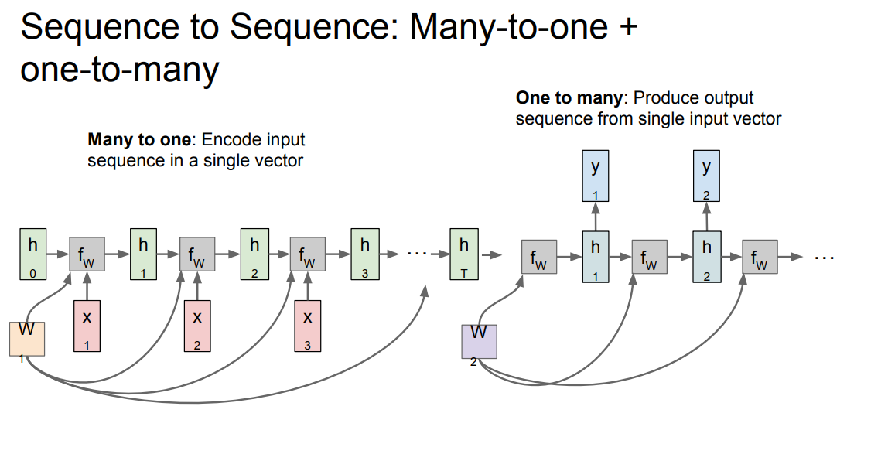
    - Encoder and decoder philosophy.

- Examples:

  - Suppose we are building words using characters. We want a model to predict the next character of a sequence. Lets say that the characters are only `[h, e, l, o]` and the words are [hello]
    - Training:
      - 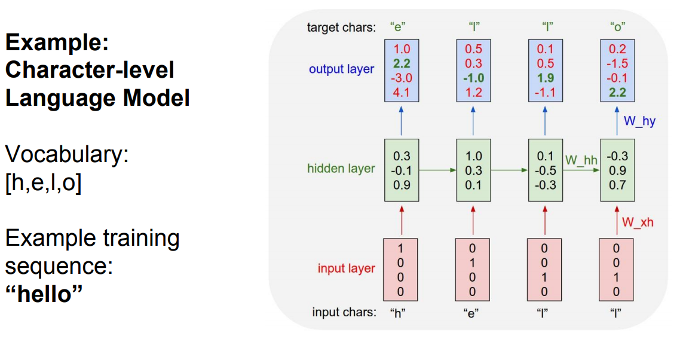
      - Only the third prediction here is true. The loss needs to be optimized.
      - We can train the network by feeding the whole word(s).
    - Testing time:
      - 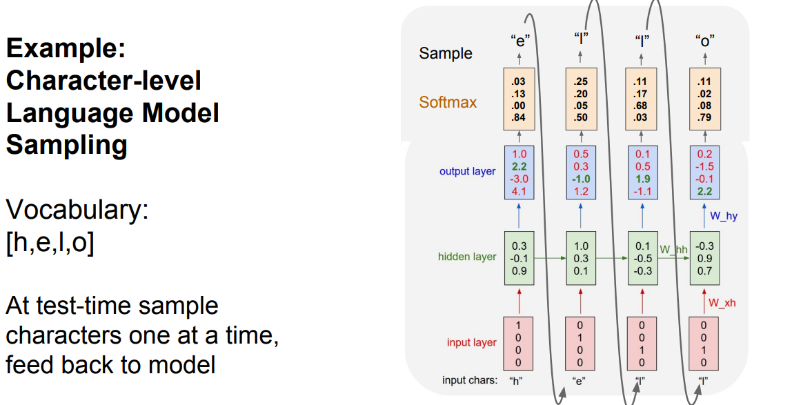
      - At test time we work with a character by character. The output character will be the next input with the other saved hidden activations.
      - This [link](https://gist.github.com/karpathy/d4dee566867f8291f086) contains all the code but uses Truncated Backpropagation through time as we will discuss.

- Backpropagation through time Forward through entire sequence to compute loss, then backward through entire sequence to compute gradient.

  - But if we choose the whole sequence it will be so slow and take so much memory and will never converge!

- So in practice people are doing "Truncated Backpropagation through time" as we go on we Run forward and backward through chunks of the sequence instead of whole sequence

  - Then Carry hidden states forward in time forever, but only backpropagate for some smaller number of steps.

- Example on image captioning:

  - 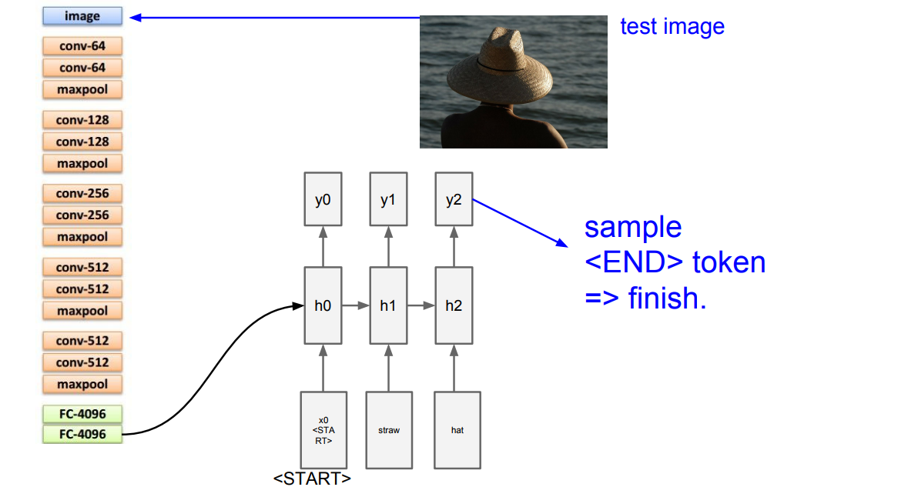
  - They use <End> token to finish running.
  - The biggest dataset for image captioning is Microsoft COCO.

- Image Captioning with Attention is a project in which when the RNN is generating captions, it looks at a specific part of the image not the whole image.

  - Image Captioning with Attention technique is also used in "Visual Question Answering" problem

- Multilayer RNNs is generally using some layers as the hidden layer that are feed into again. **LSTM** is a multilayer RNNs.

- Backward flow of gradients in RNN can explode or vanish. Exploding is controlled with gradient clipping. Vanishing is controlled with additive interactions (LSTM)

- LSTM stands for Long Short Term Memory. It was designed to help the vanishing gradient problem on RNNs.

  - It consists of:
    - f: Forget gate, Whether to erase cell
    - i: Input gate, whether to write to cell
    - g: Gate gate (?), How much to write to cell
    - o: Output gate, How much to reveal cell
  - 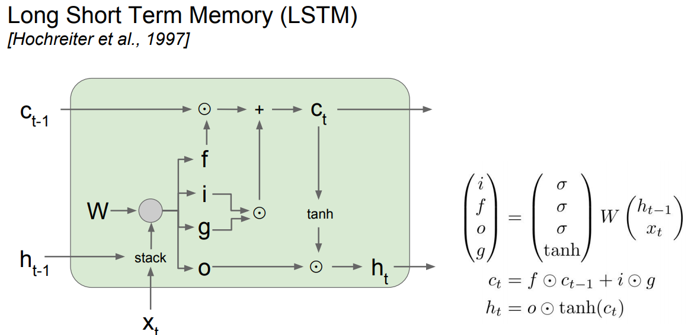
  - 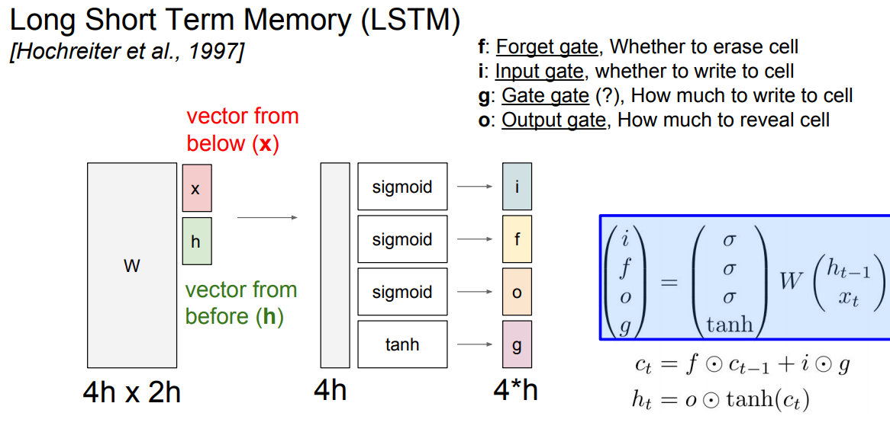
  - The LSTM gradients are easily computed like ResNet
  - The LSTM is keeping data on the long or short memory as it trains means it can remember not just the things from last layer but layers.

- Highway networks is something between ResNet and LSTM that is still in research.

- Better/simpler architectures are a hot topic of current research

- Better understanding (both theoretical and empirical) is needed.

- RNN is used for problems that uses sequences of related inputs more. Like NLP and Speech recognition.


## 11. Detection and Segmentation


<br><br>
<br><br>
These Notes was made by [Mahmoud Badry](mailto:mma18@fayoum.edu.eg) @2017